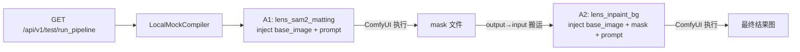

# MuseLens Phase 1 — 本地核心引擎构建 Walkthrough

## 文件结构

```
backend/app/
├── schemas/
│   ├── __init__.py
│   └── lens.py              ← Step 1: Pydantic 数据模型
├── lenses/
│   ├── __init__.py
│   └── registry.py           ← Step 2: 透镜注册表 (3个实例)
├── services/
│   ├── comfy_service.py       ← 旧版 (保留未动)
│   └── compiler.py            ← Step 3: ComfyBridge + LocalMockCompiler
├── api/v1/endpoints/
│   ├── editor.py              ← 旧版 (保留未动)
│   └── test_run.py            ← Step 4: 测试端点
└── main.py                    ← 更新：挂载 test_run 路由
```

## 数据流向



## 验证结果

| 验证项 | 结果 |
|---|---|
| [lens.py](file:///e:/MuseLens/backend/app/schemas/lens.py) 模型导入 | ✅ 通过 |
| [inject_inputs()](file:///e:/MuseLens/backend/app/schemas/lens.py#94-128) 参数注入 | ✅ sam2_matting + inpaint_bg 均通过 |
| [registry.py](file:///tmp/test_registry.py) 加载 3 个 JSON | ✅ 3 个透镜实例化成功 |
| [compiler.py](file:///e:/MuseLens/backend/app/services/compiler.py) 导入 | ✅ 通过 |
| [main.py](file:///e:/MuseLens/backend/app/main.py) 路由注册 | ✅ `/api/v1/test/run_pipeline` 已挂载 |

## 使用方法

启动 ComfyUI 后，运行 FastAPI：

```bash
cd e:\MuseLens\backend
.\venv\Scripts\uvicorn.exe app.main:app --reload
```

访问 Swagger 文档：http://127.0.0.1:8000/docs

调用测试接口：
```
GET /api/v1/test/run_pipeline?image=woman-8463055_1280.jpg&segment_prompt=Woman&inpaint_prompt=a%20cyberpunk%20room
```

> [!IMPORTANT]
> [compiler.py](file:///e:/MuseLens/backend/app/services/compiler.py) 中的 `COMFYUI_OUTPUT_DIR` / `COMFYUI_INPUT_DIR` 默认指向 `D:\AI\ComfyUI_windows_portable\ComfyUI\`，请根据实际安装路径通过环境变量修改。
