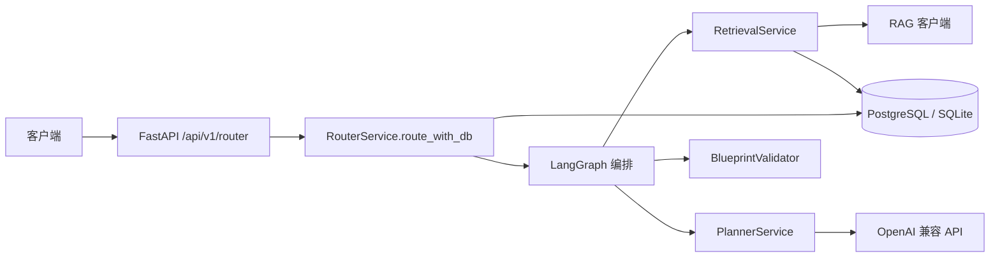
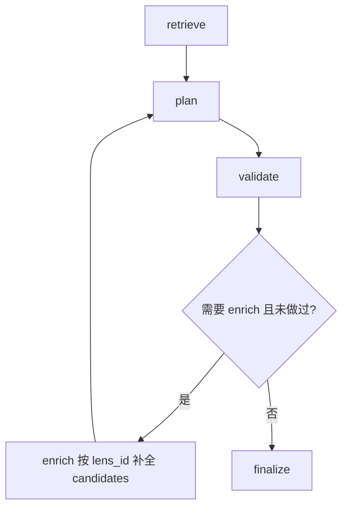

# MuseLens Router 架构与 Lens 知识库指南

本文描述**当前实现**中的意图路由（Router v2）、处理链路、HTTP 接口，以及 Lens 注册与「知识库」相关写法。实现以 `backend/app` 下代码为准；若与旧版设计文档冲突，**以代码与本文为准**。

更完整的 **「意图编排」分层设计、与理想方案的对照、追问与测试复现、知识库 JSON/md 示例**，见：[Router层-意图编排与实现对照](./Router层-意图编排与实现对照.md)。

---

## 1. 在整体后端中的位置

- **Router** 负责：根据用户自然语言 + 会话状态，产出可执行的 `DAGBlueprint`，或在信息不足时返回追问（`NEED_CLARIFICATION`）。
- **Compiler / 执行器**（本文不展开）消费 `READY` 状态下的 `blueprint`，与 Router 解耦。

---

## 2. 两条执行路径：LLM 编排 vs 规则兜底

`RouterService.route_with_db` 的决策逻辑可概括为：

| 条件 | 行为 |
|------|------|
| `db is None` | 无数据库：走内存规则版 `compile_or_ask` / `answer`（关键词 + 固定 A1→A2 管线），用于旧调用或测试。 |
| `db` 存在但 **Planner 未配置**（无 `MUSELENS_LLM_*） | 同上，避免线上直接 `FAILED`。 |
| `db` 存在且 Planner 已配置 | **Router v2**：会话持久化 + **LangGraph** 编排（见下节）。 |

Planner 通过环境变量配置（见 `app/services/planner_service.py`），典型为：

- `MUSELENS_LLM_BASE_URL`（可选，默认 OpenAI 兼容网关）
- `MUSELENS_LLM_API_KEY`
- `MUSELENS_LLM_MODEL`

---

## 3. Router v2 内部：LangGraph 编排（当前默认）

在「DB + Planner 已配置」时，一次请求的核心链路由 [`app/services/router_graph.py`](../backend/app/services/router_graph.py) 编译的图执行：

1. **retrieve**：`RetrievalService.retrieve(db, task_desc, top_k=5)`  
   - 先用 **RAG** 得到候选 `lens_id` 列表，再从 **Catalog（`lenses` 表）** 与 **示例（`lens_examples`）**、**可选 md 文档** 组装成 `LensKnowledge`，序列化后作为 Planner 的 `candidates`。
2. **plan**：`PlannerService.plan(PlannerInput)`  
   - LLM **仅允许**在 `candidates` 里选 Lens、填参数；可返回 `missing_params`、`clarification_questions`、`blueprint`。
3. **validate**：`blueprint_validator.validate`  
   - 对 `DAGBlueprint` 做静态校验（步骤、资产引用、参数名/类型、Catalog 必填等）。
4. **条件分支**（最多一轮 enrich）：若存在 `missing_params` / `clarification_questions` / 校验错误等，且尚未 enrich，则  
   **enrich** → `RetrievalService.retrieve_by_lens_ids(...)` 按 Planner 涉及的 `lens_id` **精确补全**结构化知识 → **再次 plan** → **validate** → **finalize**。
5. **finalize**：根据最终 `PlannerOutput` 与校验结果，写入 `router_sessions`，并组装 `RouterResponse`（`READY` / `NEED_CLARIFICATION` / `FAILED`）。

图运行时通过 `ContextVar` 注入会话与 `RouterService` 依赖，**不改变对外 HTTP 契约**。

---

## 4. 会话与状态持久化

- 表/模型：`RouterSessionRecord`（见 `app/models/router_session_model.py`），封装在 [`router_session_store`](../backend/app/services/router_session_store.py)。
- 新会话需提供 `user_message`、`base_image`；返回的 `session_id` 用于后续轮次。
- **追问答案**约定：问题 ID 形如 `lens_id.param_name`，写入 `collected_params`，供 Planner 的 `session_context` 与校验器使用。

---

## 5. HTTP 接口（对外）

路由挂载前缀：**`/api/v1/router`**（见 [`app/main.py`](../backend/app/main.py)）。

| 方法 | 路径 | 说明 |
|------|------|------|
| `POST` | `/api/v1/router/route` | **推荐统一入口**。`RouterRouteRequest`：可无 `session_id` 开新会话；可带 `answers` 回答追问；字段含 `user_message`、`base_image`、`base_image_meta` 等。 |
| `POST` | `/api/v1/router/compile_or_ask` | 兼容旧客户端；内部转为 `RouterRouteRequest` 再调 `route_with_db`。 |
| `POST` | `/api/v1/router/answer` | 兼容旧追问提交；同样转为 `RouterRouteRequest`。 |

响应体统一为 **`RouterResponse`**（[`app/schemas/router.py`](../backend/app/schemas/router.py)）：

| `status` | 含义 |
|----------|------|
| `ready` | 已生成可执行 `blueprint`。 |
| `need_clarification` | 需用户补充；`questions` 非空；可能暂存 `pending_blueprint` 于会话。 |
| `failed` | 无法完成；`thought_process` / `extra` 中带原因或校验错误。 |

详细字段（追问绑定 `binds`、`extra.retrieved_lenses` 等）以 OpenAPI `/docs` 与 `RouterResponse` 定义为准。

---

## 6. Lens「注册」：API + 数据库 + 内存注册表

### 6.1 HTTP

前缀 **`/api/v1/lenses`**，核心为：

- **`POST /api/v1/lenses/register`**  
  注册或覆盖一个透镜：写入 **数据库**、刷新 **内存 `LENS_REGISTRY`**，并可写入 **`lens_examples`**（few-shot）。  
  请求体字段见 [`app/api/v1/endpoints/lenses.py`](../backend/app/api/v1/endpoints/lenses.py) 中 `LensRegisterRequest`（`lens_id`、`layer`、`workflow_file_path`、`inputs`/`outputs`/`params`、`examples` 等）。

- 其它：`GET` 列表/详情、`DELETE`、`POST /reload` 等用于运维与调试。

### 6.2 注册时你需要准备什么

1. **工作流 JSON**：本地路径可被后端读取（`workflow_file_path`）；接口不负责上传文件。  
2. **结构化元数据**：`inputs` / `outputs` / `params` 与 ComfyUI 节点 `mapping` 对齐，供编译与校验。  
3. **可选 `examples`**：自然语言描述 `nl_desc` + `params_example`，进入 `lens_examples` 表，供 Retrieval 拼进 `LensKnowledge.examples`。

启动时若库中无任何 Lens，会 **种子写入内置透镜** 并 `reload_registry`（见 `main.py` 的 `lifespan`）。

---

## 7. 「知识库」在代码里指什么

这里不是单一向量库名称，而是 **三类来源的组合**：

### 7.1 RAG：候选 Lens 是谁

- 抽象接口：`BaseLensRAGClient`（[`rag_client.py`](../backend/app/services/rag_client.py)）。
- **默认**：`InMemoryLensRAGClient`（开发/测试）。
- **可选**：`PgVectorLensRAGClient`，通过环境变量切换（如 `MUSELENS_RAG_BACKEND=pgvector`、`MUSELENS_PG_DSN` 等），与 Router 解耦。

向量表同步、运维步骤见专文：[RAG_pgvector 接入与扩展指南](./RAG_pgvector%20接入与扩展指南.md)。

### 7.2 Catalog：`lenses` 表 + 内存模板

- 注册 API 写入 ORM `LensRecord`，并加载为 `LensTemplate` 进入 `registry`。  
- **Retriever** 在拿到 RAG 返回的 `lens_id` 后，用表内 `description`、`params` 等拼 **结构化** `LensKnowledge`。

### 7.3 可选 Markdown 文档（叠加规则）

- 默认目录可由环境变量 **`MUSELENS_LENS_DOCS_DIR`** 指向（未设置时使用仓库内 `backend/app/lenses/docs/`）。  
- 文件命名：**`<lens_id>.md`**，格式为 **YAML frontmatter + Markdown 正文**。  
- 用途：叠加 `description`、`params` 级说明、必填、默认值、规则与 **md 内 examples**，供 Planner 理解与追问。  

**格式细则**以仓库内为准：[backend/app/lenses/docs/LENS_DOC_FORMAT.md](../backend/app/lenses/docs/LENS_DOC_FORMAT.md)。

### 7.4 表 `lens_examples`

- 由注册接口 `examples` 数组写入；Retrieval 与 md 内 `examples` 一并并入 `LensKnowledge.examples`。

### 7.5 enrich：`retrieve_by_lens_ids`

当首轮 Planner 指出缺失或校验需要更完整 schema 时，图编排会按涉及的 **`lens_id` 精确拉取** 上述 Catalog + docs + examples（**不再次量纲召回**），再喂给第二轮 Planner。实现见 `RetrievalService.retrieve_by_lens_ids`。

---

## 8. 编写新 Lens 时的推荐顺序

1. 准备 ComfyUI 工作流 JSON，确保路径可被后端读取。  
2. 调用 **`POST /api/v1/lenses/register`** 写入 `inputs`/`outputs`/`params` 与可选 `examples`。  
3. （推荐）在 `lenses/docs/<lens_id>.md` 按 [LENS_DOC_FORMAT.md](../backend/app/lenses/docs/LENS_DOC_FORMAT.md) 补充 frontmatter，强化参数说明与追问规则。  
4. 若使用 pgvector：注册/修改透镜后按 [RAG 指南](./RAG_pgvector%20接入与扩展指南.md) 同步向量。  
5. 用 **`POST /api/v1/router/route`** 联调，检查 `extra.retrieved_lenses`、追问与 `READY` 行为。

更完整的清单可参考：[Lens 规范文档 + 新建 Lens checklist](./Lens%20规范文档%20+%20新建%20Lens%20checklist.md)、[lens_registration_guide](./lens_registration_guide.md)。

---

## 9. 运行与调试

- **Docker**：仓库根目录 `docker compose -f docker-compose.backend.yml up --build`（详见 [README.md](../README.md) 与 [后端Docker一键启动说明](./后端Docker一键启动说明.md)）。  
- **本地 Conda**：在 **`backend` 目录下**安装依赖并运行 `pytest`，保证 `app` 包可导入。  
- **OpenAPI**：启动后访问 `http://127.0.0.1:8000/docs` 查看 Router/Lenses 的请求响应模型。

---

## 10. 相关源码索引（便于跳转）

| 主题 | 路径 |
|------|------|
| Router 入口与兼容端点 | `backend/app/api/v1/endpoints/router.py` |
| 路由服务与兜底分支 | `backend/app/services/router_service.py` |
| LangGraph 编排 | `backend/app/services/router_graph.py` |
| 检索与 enrich | `backend/app/services/retrieval_service.py` |
| Planner / LLM | `backend/app/services/planner_service.py` |
| 蓝图校验 | `backend/app/services/blueprint_validator.py` |
| RAG 实现 | `backend/app/services/rag_client.py` |
| 请求/响应模型 | `backend/app/schemas/router.py`、`app/schemas/planner.py` |

---

*文档版本：与 Router v2（LangGraph + enrich）及当前 API 对齐；后续若编排或接口变更，请同步更新本文。*
